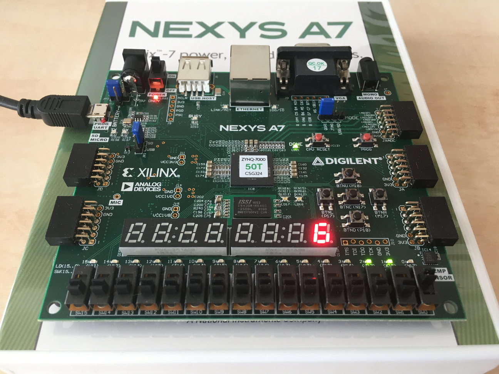
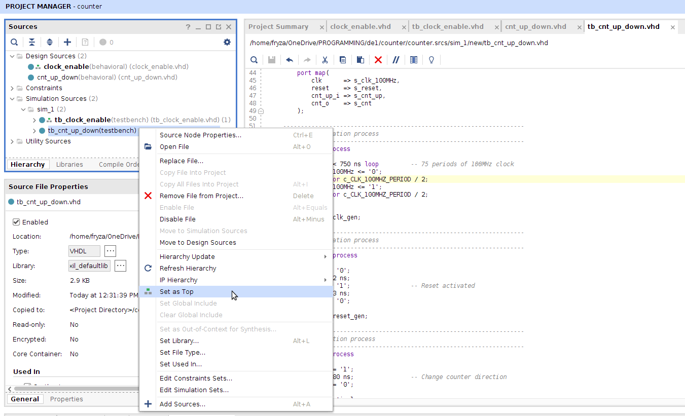
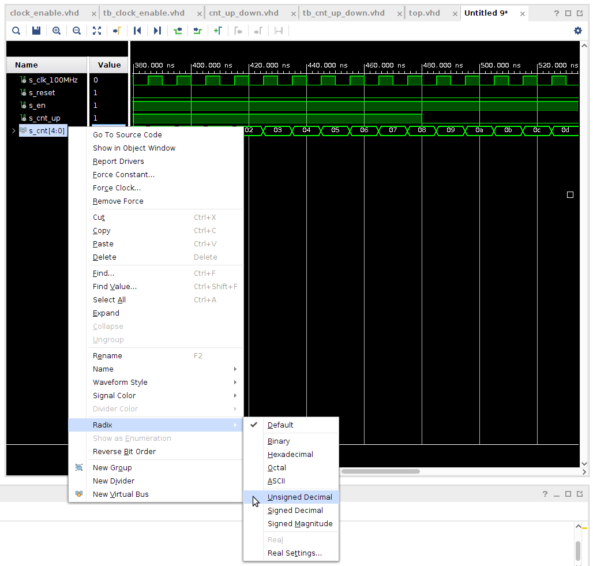

# Lab 5: Binary counter

#### Objectives

The purpose of this laboratory exercise is to become familiar with the creation of sequential processes in VHDL, next to implement a clock enable signal to drive another logic with slower clock, and to design a binary counter.




## Preparation tasks (done before the lab at home)

The Nexys A7 board provides six push buttons. See schematic or reference manual of the Nexys A7 board and find out the connection of these push buttons. What output the push buttons normally generate when they are at rest, and what output when the push buttons are pressed?

&nbsp;

&nbsp;

&nbsp;

&nbsp;

&nbsp;

&nbsp;


Calculate how many periods of clock signal with frequency of 100&nbsp;MHz contain time intervals 2&nbsp;ms, 4&nbsp;ms, 10&nbsp;ms, 250&nbsp;ms, 500&nbsp;ms, and 1&nbsp;s. Write values in decimal, binary, and hexadecimal forms.

   &nbsp; 
   
   &nbsp;

   | **Time interval** | **Number of clk periods** | **Number of clk periods in hex** | **Number of clk periods in binary** |
   | :-: | :-: | :-: | :-: |
   | 2&nbsp;ms | 200 000 | `x"3_0d40"` | `b"0011_0000_1101_0100_0000"` |
   | 4&nbsp;ms |
   | 10&nbsp;ms |
   | 250&nbsp;ms |
   | 500&nbsp;ms |
   | 1&nbsp;sec | 100 000 000 | `x"5F5_E100"` | `b"0101_1111_0101_1110_0001_0000_0000"` |


## Part 1: Synchronize Git and create a new folder

1. Open a Linux terminal, change path to your Digital-electronics-1 working directory, and synchronize the contents with GitHub.
2. Create a new folder `Labs/05-counter`


## Part 2: VHDL code for clock enable

To drive another logic in the design (with slower clock), it is better to generate a **clock enable signal** instead of creating another clock domain (using clock dividers) that would cause timing issues or clock domain crossing problems such as metastability, data loss, and data incoherency.

Perform the following steps to simulate the clock enable circuit.

   1. Create a new Vivado project `counter` in your `Labs/05-counter` working folder.
   2. Create a VHDL source file `clock_enable.vhd` for the clock enable circuit.
   3. Choose default board: `Nexys A7-50T`.
   4. Open the [Clock enable circuit example](https://www.edaplayground.com/x/5LiJ) and copy/paste the `design.vhd` code to your `clock_enable.vhd` file. Take a look at the new parts of the VHDL source code, such as package for arithmetic operations, `generic` part, internal signal, and [synchronous process](https://github.com/tomas-fryza/Digital-electronics-1/wiki/Processes). **Generic** allows us to pass information into an entity and component. Since a generic cannot be modified inside the architecture, it is like a constant.
   5. Create a simulation source `tb_clock_enable.vhd`, copy/paste the `testbench.vhd` code and run the simulation. Verify the meaning of the constant `c_MAX` and reset generation process.
   
   The default simulation run time is set to 1000&nbsp;ns in Vivado. You can change it in the menu **Tools > Settings...**


## Part 3: VHDL code for bidirectional binary counter

[Bidirectional counters](https://www.electronics-tutorials.ws/counter/count_4.html), also known as Up/Down counters, are capable of counting in either direction through any given count sequence and they can be reversed at any point within their count sequence by using an additional control input as shown below.

Perform the following steps to simulate the bidirectional N-bit counter.

   1. Create a new design source `cnt_up_down.vhd` in your project.
   2. Open the [N-bit Up/Down binary counter example](https://www.edaplayground.com/x/5bgq) and copy/paste the `design.vhd` code to your `cnt_up_down.vhd` file. Take a look at the new parts of the VHDL source code.

   Note that an internal `s_cnt_local` signal is used to implement the counter. This is because the **output** port `cnt_o` cannot be read and therefore the operation `cnt_o + 1` cannot be performed. Also note that local value must be retyped to the output port.

   3. Create a simulation source `tb_cnt_up_down.vhd`, copy/paste the `testbench.vhd` code.
   4. Change the testbench you want to simulate, right click to file name and select `Set as Top`. Run the simulation. Verify the meaning of the constant `c_CNT_WIDTH` and reset generation process.



   5. Complete architecture of the counter, make it bidirectional, and simulate again. 

   Note that for any vector, it is possible to change the numeric system in the simulation which represents the current value. To do so, right-click the vector name (here `s_cnt[4:0]`) and select **Radix > Unsigned Decimal** from the context menu. You can change the vector color by **Signal Color** as well.




## Part 4: Top level VHDL code


Perform the following steps to implement the 4-bit bidirectional counter on the Nexys A7 board.

   1. Create a new design source `top.vhd` in your project.
   2. Define an entity `top` as follows.

   | **Port name** | **Direction** | **Type** | **Description** |
   | :-: | :-: | :-: | :-- |
   | `CLK100MHZ` | input | `std_logic` | Main clock |
   | `BTNC` | input | `std_logic` | Reset |
   | `SW`  | input   | `std_logic_vector(1 - 1 downto 0)` | Counter direction |
   | `LED` | output  | `std_logic_vector(4 - 1 downto 0)` | Counter value LED indicators |
   | `CA` | output | `std_logic` | Cathod A |
   | `CB` | output | `std_logic` | Cathod B |
   | `CC` | output | `std_logic` | Cathod C |
   | `CD` | output | `std_logic` | Cathod D |
   | `CE` | output | `std_logic` | Cathod E |
   | `CF` | output | `std_logic` | Cathod F |
   | `CG` | output | `std_logic` | Cathod G |
   | `AN` | output | `std_logic_vector(8 - 1 downto 0)` | Common anode signals to individual displays |

   3. Create a new [constraints XDC](https://github.com/Digilent/digilent-xdc) file: `nexys-a7-50t` and uncomment used pins according to the entity.
   4. Use direct instantiation and define an architecture of the top level: make a copy of `clock_enable`, `cnt_up_down`, and `hex_7seg` entities. Copy source file `hex_7seg.vhd` from the previous laboratory to the current source folder.

```vhdl

------------------------------------------------------------------------
-- Architecture body for top level
------------------------------------------------------------------------
architecture behavioral of top is

    -- Internal clock enable
    signal s_en  : std_logic;
    -- Internal counter
    signal s_cnt : std_logic_vector(4 - 1 downto 0);

begin

    --------------------------------------------------------------------
    -- Instance (copy) of clock_enable entity
    clk_en0 : entity work.clock_enable
        generic map(
            --- WRITE YOUR CODE HERE
        )
        port map(
            --- WRITE YOUR CODE HERE
        );

    --------------------------------------------------------------------
    -- Instance (copy) of cnt_up_down entity
    bin_cnt0 : entity work.cnt_up_down
        generic map(
            --- WRITE YOUR CODE HERE
        )
        port map(
            --- WRITE YOUR CODE HERE
        );

    -- Display input value
    LED(3 downto 0) <= s_cnt;

    --------------------------------------------------------------------
    -- Instance (copy) of hex_7seg entity
    hex2seg : entity work.hex_7seg
        port map(
            hex_i    => s_cnt,
            seg_o(6) => CA,
            seg_o(5) => CB,
            seg_o(4) => CC,
            seg_o(3) => CD,
            seg_o(2) => CE,
            seg_o(1) => CF,
            seg_o(0) => CG
        );

    -- Connect one common anode to 3.3V
    AN <= b"1111_1110";

end architecture behavioral;
```

   5. Compile the project and download the generated bitstream into the FPGA chip.
   6. Test the functionality of the 4-bit counter by toggling the switch, pressing the button and observing the display and LEDs.
   7. Use **IMPLEMENTATION > Open Implemented Design > Schematic** to see the generated structure.


## Synchronize git

Use `cd ..` command in Linux console terminal and change the working directory to `Digital-electronics-1`. Then use [git commands](https://github.com/joshnh/Git-Commands) to add, commit, and push all local changes to your remote repository. Check the repository at GitHub web page for changes.


## Experiments on your own

1. Add a second instantiation (copy) of the counter (`bin_cnt1`) and clock enable (`clk_en1`) entities and make a 16-bit counter with a different time base. Display its value on LED(15:0).


## Lab assignment

1. Bidirectional counter. Submit:
    * VHDL code of the process (`p_cnt_up_down`).

2. Second 16-bit counter. Submit:
    * (Hand-drawn) sketch of the top layer.

The deadline for submitting the assignment is before the start of the next laboratory exercise. Use [BUT e-learning](https://moodle.vutbr.cz/) web page and submit a single PDF file.
