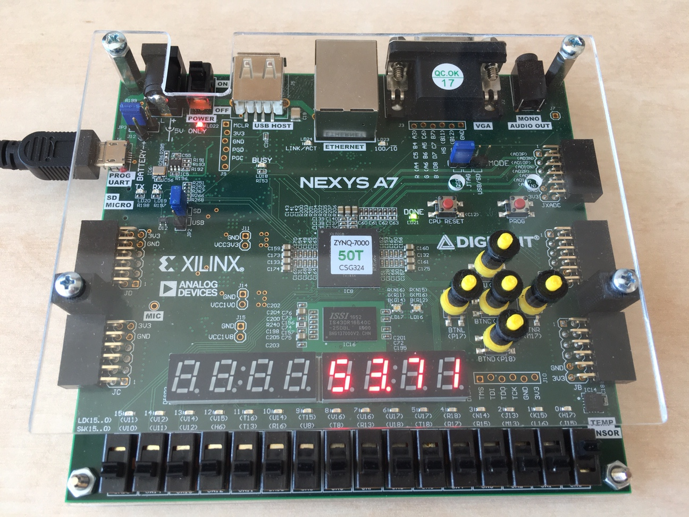
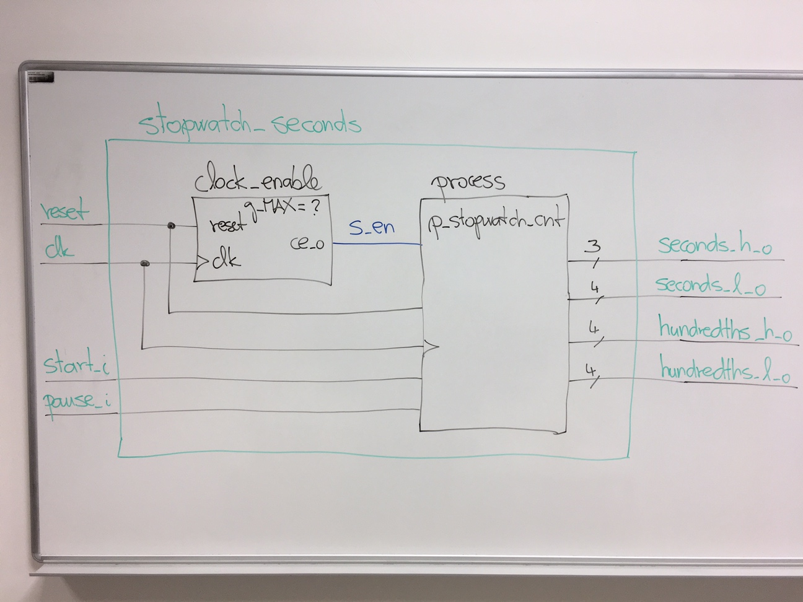

# Lab 7: Stopwatch

#### Objectives

In this laboratory exercise, you will implement several decimal counters to create a stopwatch and display its value on a 7-segment display. Let the stopwatch display at least four places, from hundreds of seconds to tens of seconds.




## Preparation tasks (done before the lab at home)

Consider the clock enable circuit from previous laboratories and find out the values of its parameter `g_MAX` so that the output signal `ce_o` has the frequency 100&nbsp;Hz or 1&nbsp;kHz. Let the frequency of the main clock signal be 100&nbsp;MHz.

   | **Frequency** | **Number of clk periods (g_MAX)** | **Number of clk periods in hex** | **Number of clk periods in binary** |
   | :-: | :-: | :-: | :-: |
   | 100&nbsp;Hz | | |
   | 1000&nbsp;Hz | | |


## Part 1: Synchronize Git and create a new folder

1. Synchronize the contents of your Digital-electronics-1 working directory with GitHub.
2. Create a new folder `Labs/07-stopwatch`


## Part 2: VHDL code for stopwatch

Let the stopwatch counts the time in the form of a **seconds.hundredths** and the maximum value is `59.99` (1 minute), then the time is reset to `00.00` and the counting continues. The counter increment must be performed every 10&nbsp;ms (one hundredth of a second) with the clock enable signal. In addition, the counting is started and paused by input signals. The counter value is reset by the synchronous reset input.

Use an approach that uses four different counters (one counter for each decade) and counts from 0 to 9 (or to 5). The lowest of the counters is incremented every 10&nbsp;ms, and each higher-order counter is incremented if all lower-order counters are equal to the maximum value. To do this, use a single sequential process.

Perform the following steps to model the stopwatch counter.

   1. Create a new Vivado RTL project `stopwatch` in your `Labs/07-stopwatch` working folder.
   2. Create a VHDL source file `stopwatch_seconds.vhd` for the stopwatch circuit.
   3. Choose default board: `Nexys A7-50T`.
   4. Open the [Stopwatch](https://www.edaplayground.com/x/2uKg) example and copy/paste the `design.vhd` code to your `stopwatch_seconds.vhd` file. Copy source file of clock enable from previous labs to `stopwatch/stopwatch.srcs/sources_1/new/` folder and add it to the project.
   5. Complete the stopwatch code according to the following block diagram.




## Part 3: Stopwatch simulation

Perform the following steps to simulate stopwatch counter.

   1. Create a simulation source `tb_stopwatch_seconds.vhd`, copy/paste the `testbench.vhd` code from EDA Playground example. Note that the maximum value of clock enable circuit is set to 1 for the simulation, ie the stopwatch increments its value with a frequency of 100&nbsp;MHz and not 100&nbsp;Hz.
   2. Change the duration of simulation to 100000ns in **Tools > Settings... > Simulation > Simulation**.
   3. Run the simulation and verify that the stopwatch is started, paused, and reset correctly.


## Part 4: Top level VHDL code

Perform the following steps to implement the stopwatch counter on the Nexys A7 board.

   1. Create a new design source `top.vhd` in your project.
   2. Define an entity `top` as follows.

   | **Port name** | **Direction** | **Type** | **Description** |
   | :-: | :-: | :-: | :-- |
   | `CLK100MHZ` | input | `std_logic` | Main clock |
   | `BTNC` | input | `std_logic` | Synchronous reset |
   | `BTND` | input | `std_logic` | Start button |
   | `SW`  | input   | `std_logic_vector(1 - 1 downto 0)` | Pause |
   | `CA` | output | `std_logic` | Cathod A |
   | `CB` | output | `std_logic` | Cathod B |
   | `CC` | output | `std_logic` | Cathod C |
   | `CD` | output | `std_logic` | Cathod D |
   | `CE` | output | `std_logic` | Cathod E |
   | `CF` | output | `std_logic` | Cathod F |
   | `CG` | output | `std_logic` | Cathod G |
   | `DP` | output | `std_logic` | Decimal point |
   | `AN` | output | `std_logic_vector(8 - 1 downto 0)` | Common anode signals to individual displays |

   3. Create a new [constraints XDC](https://github.com/Digilent/digilent-xdc) file: `nexys-a7-50t` and uncomment used pins according to the entity.
   4. Copy source files of binary counter, 7-segment decoder, display driver modules from previous labs to `stopwatch/stopwatch.srcs/sources_1/new/` folder and add then to the project.
   5. Use direct instantiation and define an architecture of the top level.


TBD

```vhdl
------------------------------------------------------------------------
-- Architecture body for top level
------------------------------------------------------------------------
architecture behavioral of top is
    -- No internal signals
begin

    --------------------------------------------------------------------
    -- Instance (copy) of driver_7seg_4digits entity
    driver_seg0 : entity work.driver_7seg_4digits
        port map(
            clk      => CLK100MHZ,
            reset    => BTNC,
            data0_i(3) => SW(3),
            data0_i(2) => SW(2),
            data0_i(1) => SW(1),
            data0_i(0) => SW(0),
            --- WRITE YOUR CODE HERE
            dp_i => "0111",
            --- WRITE YOUR CODE HERE
        );

    -- Disconnect the top four digits of the 7-segment display
    AN(7 downto 4) <= b"1111";

end architecture behavioral;
```

   5. Compile the project and download the generated bitstream `display_driver/display_driver.runs/impl_1/top.bit` into the FPGA chip.
   6. Test the functionality of the driver by toggling the switches and observing the display.
   7. Use **IMPLEMENTATION > Open Implemented Design > Schematic** to see the generated structure.


## Synchronize git

Your repository must include `README.md` file with simulation screenshot(s), next the source code for stopwatch, testbench code, and source code or schematic of top level implementation. Submit your solution **no later** than Friday.
