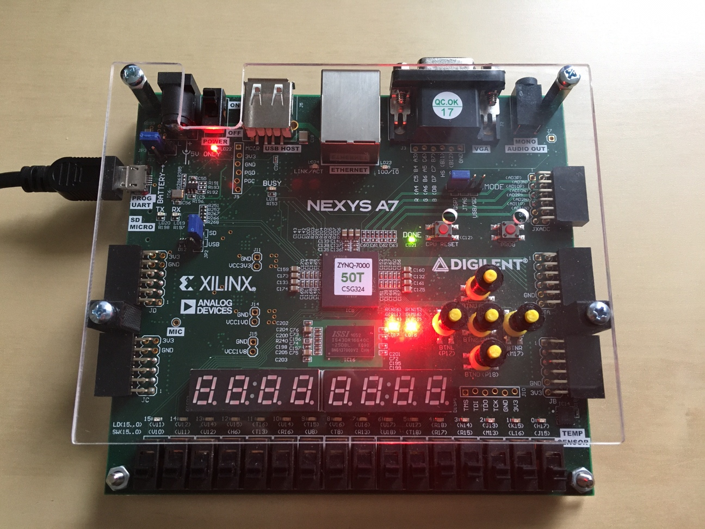
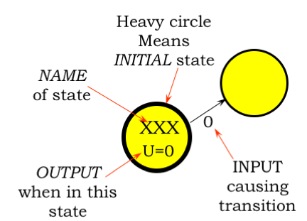
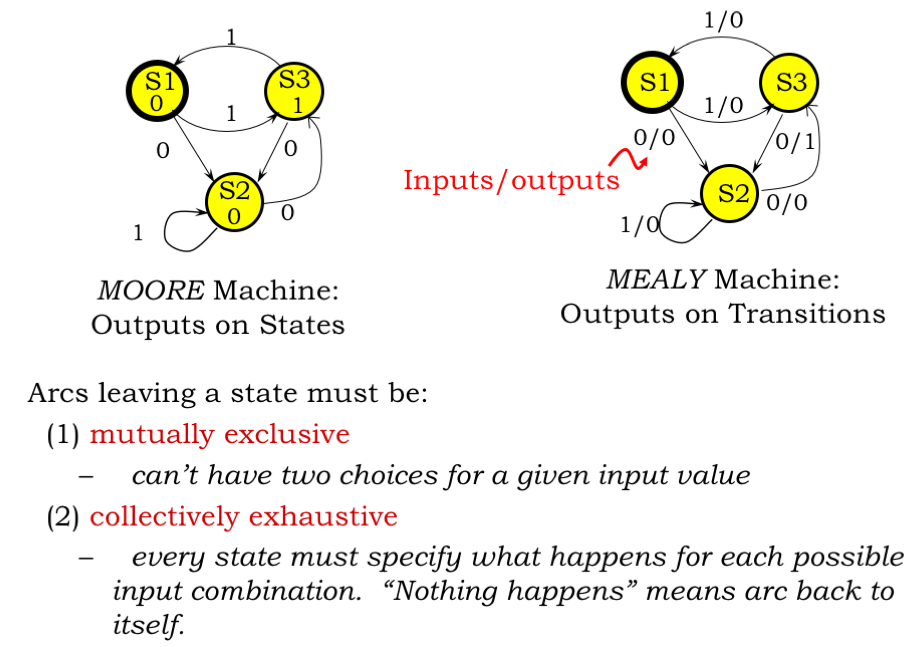
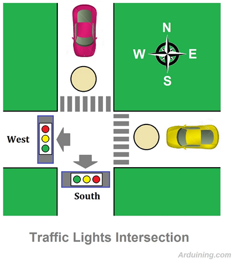

# Lab 8: Traffic light controller

### Learning objectives

In this laboratory exercise you will implement a finite state machine (FSM), specifically a traffic light controller at a junction. At first, the intersection will contain only two one-way streets with a fixed time control system in which traffic lights are configured to turn on the green, yellow, and red color after a given period. Subsequently, the system will be extended with a smarter way of driving.




## Preparation tasks (done before the lab at home)

Read the article [Implementing a Finite State Machine in VHDL](https://www.allaboutcircuits.com/technical-articles/implementing-a-finite-state-machine-in-vhdl/) (parts **A Bit of Background** and **The Finite State Machine**) and understand what a FSM is.

Fill in the table with the state names and output values in the order in which they are listed below.

| **Input P** | `0` | `0` | `1` | `1` | `0` | `1` | `0` | `1` | `1` | `1` | `1` | `0` | `0` | `1` | `1` | `1` |
| :-- | :-: | :-: | :-: | :-: | :-: | :-: | :-: | :-: | :-: | :-: | :-: | :-: | :-: | :-: | :-: | :-: |
| **State** | A |  |  |  |  |  |  |  |  |  |  |  |  |  |  |  |
| **Output R** | `0` |  |  |  |  |  |  |  |  |  |  |  |  |  |  |  |

See schematic or reference manual of the Nexys board and find out the connection of two RGB LEDs. How to control them to get red, yellow, or green colors?

&nbsp;

&nbsp;

&nbsp;

&nbsp;

&nbsp;

&nbsp;

| **RGB LED** | **Artix-7 pin names** | **Red** | **Yellow** | **Green** |
| :-: | :-: | :-: | :-: | :-: |
| LD16 | N15, M16, R12 | `1,0,0` |  |  |
| LD17 |  |  |  |  |


## Part 1: Synchronize Git and create a new folder

Run Git Bash (Windows) of Terminal (Linux) and synchronize local and remote repositories. Create a new working folder `Labs/08-traffic_lights`.


## Part 2: Finite State Machine (FSM)

A finite state machine (FSM) is a computation model that can be implemented with hardware or software and can be used to simulate sequential logic. There are two different main types of finite state machines: the Mealy FSM and the Moore FSM. The fundamental difference between these two types lies in the management of the outputs:

   * The output of the **Mealy** FSM depends on the present state and inputs.
   * The outputs of a **Moore** machine depend only on the present state and not on the inputs, as shown in the figure [[1]](https://www.allaboutcircuits.com/technical-articles/implementing-a-finite-state-machine-in-vhdl/).


A common way how to represent a finite state machine is a **state diagram** which contains:
   * Circles and
   * Directed arcs to the next state circles.

Circles represent the machine states labelled with a reflecting state and for a Moore machine also the output value.



Directed arcs represent the transitions between states and they are labelled with input/output pair for a Mealy machine and with input for a Moore machine as shown [[2]](https://ocw.mit.edu/courses/electrical-engineering-and-computer-science/6-004-computation-structures-spring-2017/c6/c6s1/).




## Part 3: Traffic light controller VHDL code

Let a intersection contains only two one-way streets with a fixed time control system in which traffic lights are configured to turn on the green, yellow, and red color after a given period. If it is red in one direction on the traffic light, it is green in the other, and green in the first direction can only occur when it is red in the other direction.

This following exercise is inspired by [Example 62: Traffic Light Controller](https://www.youtube.com/watch?v=6_Rotnw1hFM) video. Note that several changes have been made to preserve the programming style from previous exercises:
   * Use `numeric_std` package instead of `IEEE.STD_LOGIC_unsigned`,
   * Types for internal signal/constants changed from `STD_LOGIC_VECTOR(3 downto 0)` to `unsigned`,
   * Edge detector `clk'event and clk = '1'` changed to `rising_edge(clk)`.

Perform the following steps to model the traffic light controller.
   1. Create a new Vivado RTL project `traffic` in your `Labs/08-traffic_lights` working folder.
   2. Create a VHDL source file `tlc.vhd` for the traffic light controller circuit.
   3. Choose default board: `Nexys A7-50T`.
   4. Open the [Traffic light controller](https://www.edaplayground.com/x/5HBi) example and copy/paste the `design.vhd` code to your `tlc.vhd` file. Copy source file of XXXXXX  clock enable circuit from previous labs to `stopwatch/stopwatch.srcs/sources_1/new/` folder and add it to the project.
   5. Complete the traffic light code according to the following block diagram.


XXXXX


| **Current state** | **Direction North** | **Direction West** |
| :-- | :-: | :-: |
| `RESET`      | red    | red |
| `NORTH_GO`   | green  | red |
| `NORTH_WAIT` | yellow | red |
| `WEST_GO`    | red    | green |
| `WEST_WAIT`  | red    | yellow |


```vhdl
library ieee;
use ieee.std_logic_1164.all;
--use ieee.std_logic_unsigned.all;
use ieee.numeric_std.all;

...

architecture traffic of traffic is
    ...
    --signal count: std_logic_vector(3 downto 0);
    --constant SEC5: std_logic_vector(3 downto 0) := "1111";
    --constant SEC1: std_logic_vector(3 downto 0) := "0011";
    signal count : unsigned(3 downto 0);
    constant SEC5: unsigned(3 downto 0) := "1111";
    constant SEC1: unsigned(3 downto 0) := "0011";

    ...

        --elsif clk'event and clk = '1' then
        elsif rising_edge(clk) then
        ...

end traffic;
```

Change the reset in the example from asynchronous to synchronous.

Follow programming conventions and coding style from previous lab exercises and rename all inputs, outputs and internal signals.

Rename the states `s0`, `s1`, .., `s5` from the example to more meaningful and draw the state diagram.


## Part 4: Traffic light simulation

Design and simulate traffic light FSM in [EDA playground](https://www.edaplayground.com) or Xilinx ISE. Write a testbench that verifies all the functions of your traffic light controller (reset, timing, output lights).


## Part 5: Top level VHDL code

Implement the top level in VHDL **or instead** draw a block diagram of used modules and name all inputs, outputs and internal signals. Use the `clock_enable` entity with the correct timing (the duration of each state should be 1 or 5 seconds).


## Synchronize git

Synchronize the contents of your Digital-electronics-1 working directory with GitHub.


## Experiments on your own

1. Follow the [exercise inspired by prof. Jon Valvano](https://arduining.com/2015/09/18/traffic-light-states-machine-with-arduino/) from University of Texas and desing an enhanced traffic light controller for the intersection of two equally busy one-way streets. The controller using two sensors and 6 lights. Two sensors detects the presence of cars in each direction and the goal is to maximize traffic flow, minimize waiting time at a red light, and avoid accidents.

   

   Explain how the intersection throughput is maximized.

   Draw a state diagram of your implementation.


## Lab assignment

1. Preparation tasks (done before the lab at home). Submit:
    * Xxx,
    * Xxx.

2. Xxx. Submit:
    * VHDL code of xxx,
    * Screenshot(s) of the simulation, from which it is clear xxxx work correctly,
    * VHDL code of the top layer architecture.

3. Xxx. Submit:
    * (Hand-drawn) sketch of the xxx schematic.

The deadline for submitting the task is the day before the next laboratory exercise. Use [BUT e-learning](https://moodle.vutbr.cz/) web page and submit a single PDF file.
